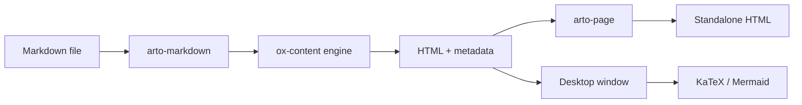

# Architecture

How a Markdown file on disk becomes a page you can read, and which crate owns
each step of the journey.

## The pipeline

Each stage hands the next one a value it fully owns, so a failure anywhere is
a failure with a place to point at.

> [!NOTE]
> The renderer never reaches the network. Every asset it needs — the
> stylesheet, the highlighter, the diagram scripts — is compiled into the
> binary at build time.

## Crates

| Crate | Responsibility |
| --- | --- |
| `arto` | The desktop application: windows, menus, state |
| `arto-markdown` | Turning Markdown into HTML the way GitHub does |
| `arto-config` | Preferences and keybindings on disk |
| `arto-keybindings` | The binding engine and the Default/Vim/Emacs presets |
| `arto-page` | Standalone HTML output for `arto page` |

## Rendering

What the engine draws, and how, is in [rendering](rendering.md). Diagrams have
[a page of their own](diagrams.md).

## Windows

One document to a window. The reasons are in
[RFC 0001](../../rfcs/0001-document-windows.md).

## State

Everything the app remembers — what you read, what you starred, where you
stopped — lives in plain JSON beside `config.json`, so it can be inspected,
backed up, or thrown away without a tool.
