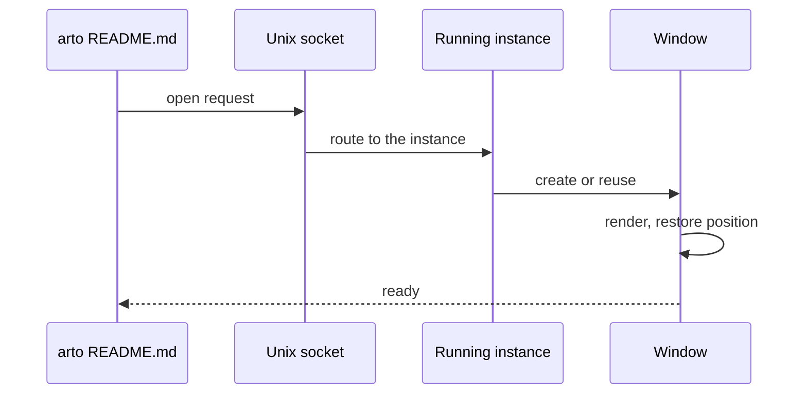
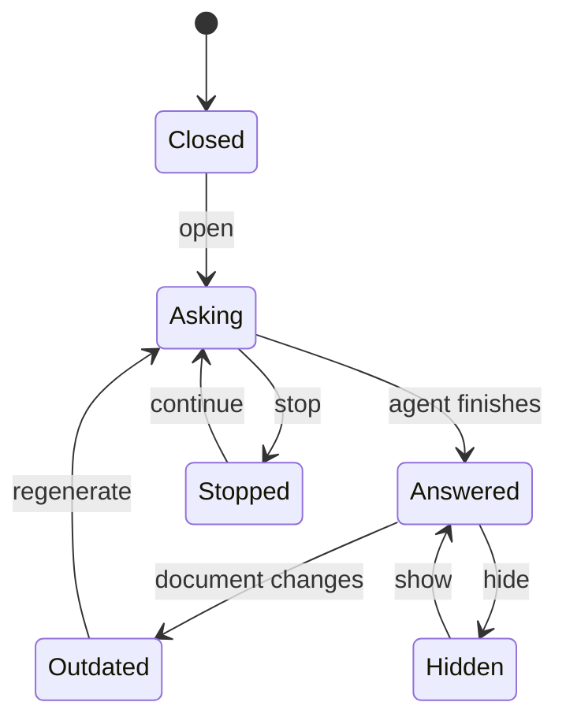
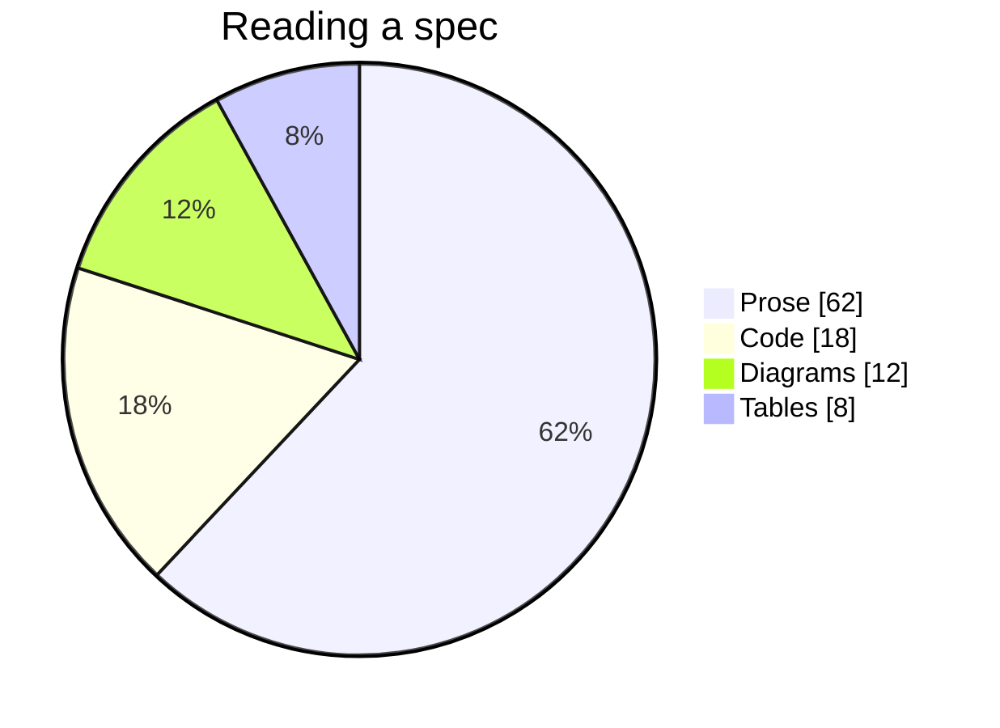

# Diagrams

Mermaid diagrams are drawn in the page as you reach them, and any of them
opens in a window of its own with zoom, pan and copy-as-image.

## How a window opens a document

## The life of a lens

## Where the time goes

