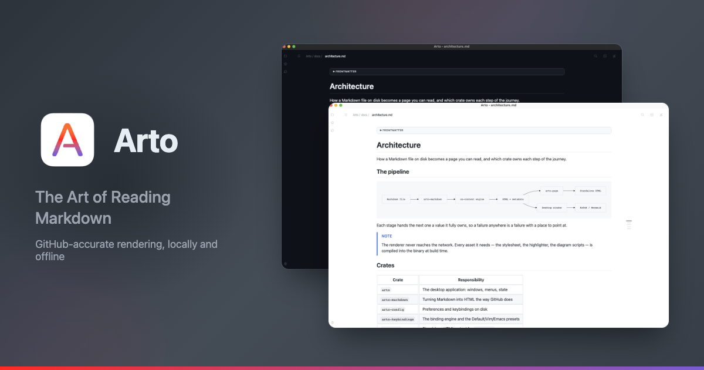

# Images

A relative image is read from beside the document; one from another host is
the only thing the renderer ever fetches.

Any image opens in a viewer of its own, which takes the alt text as its title.

## Sizing

An image is drawn at its own width until the column is narrower, and never
wider than the text around it. Raw HTML can ask for a width:

